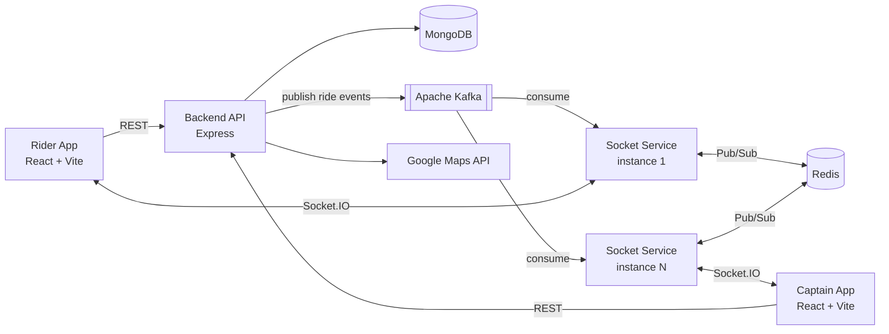

# 🚖 ZenoDrive

**Real-time cab booking platform with On-Spot Booking.** Riders can instantly book an idle cab that's right next to them, instead of waiting for an algorithm to assign a driver.

Built on an **event-driven, horizontally scalable** architecture: Apache Kafka for event streaming, Redis Pub/Sub for cross-instance WebSocket routing, and Socket.IO for live updates.

<!-- Add a live link once deployed: **Live Demo:** https://your-app.vercel.app -->

---

## ✨ Key Features

- **⚡ On-Spot Booking**: See idle cabs nearby and book one instantly, which cuts passenger wait time.
- **📍 Live Location Tracking**: Real-time driver location updates through Socket.IO.
- **🔄 Real-time Ride Lifecycle**: Request, accept, confirm and finish, with every step pushed live to both rider and captain.
- **🗺️ Location-based Matching**: Google Maps API for geocoding, distance and nearby-captain lookup.
- **🔐 Authentication**: JWT-based login and signup for riders and captains, with protected routes.
- **📈 Horizontally Scalable Sockets**: Redis Pub/Sub routes events to the right socket instance, so the WebSocket layer can scale out.

---

## 🏗️ Architecture



**How it works:**
1. The Backend handles REST requests (auth, rides, maps) and publishes ride events to **Kafka**.
2. The **Socket Service** consumes those events and delivers them to connected clients over **Socket.IO**.
3. **Redis Pub/Sub** makes sure an event reaches the right user even when that user is connected to a different socket instance.

This split decouples the request/response path from real-time delivery, so each service scales independently.

---

## 🛠️ Tech Stack

| Layer | Technologies |
|---|---|
| Frontend | React, Vite, Tailwind CSS, Socket.IO Client, Context API |
| Backend | Node.js, Express.js, MongoDB, JWT, Kafka (producer) |
| Real-time | Socket.IO, Redis Pub/Sub, Kafka (consumer) |
| APIs | Google Maps API |
| DevOps | Docker Compose, Vercel |

---

## 📁 Project Structure

```
ZenoDrive/
├── Backend/          # REST API: auth, captains, rides, maps, Kafka producer
├── Frontend/         # React + Vite client for riders and captains
└── socket-service/   # Socket.IO server, Kafka consumer, Redis Pub/Sub
```

---

## 🚀 Getting Started

### Prerequisites
- Node.js 18+
- MongoDB
- Redis
- Apache Kafka
- Google Maps API key

### 1. Clone
```bash
git clone https://github.com/paradise2580/ZenoDrive.git
cd ZenoDrive
```

### 2. Start Kafka and Redis
```bash
cd socket-service
docker compose up -d
```

### 3. Backend
```bash
cd Backend
npm install
node server.js
```

### 4. Socket Service
```bash
cd socket-service
npm install
node index.js
```

### 5. Frontend
```bash
cd Frontend
npm install
npm run dev
```

---

## 🔧 Environment Variables

Create a `.env` file in each service:

| Service | Required |
|---|---|
| `Backend/` | MongoDB URI, JWT secret, Google Maps API key, Kafka broker URL |
| `socket-service/` | Redis URL, Kafka broker URL, MongoDB URI |
| `Frontend/` | Backend API URL, Socket service URL |

---

## 📡 API Endpoints

| Method | Endpoint | Description |
|---|---|---|
| POST | `/api/users/register` | Register rider |
| POST | `/api/users/login` | Rider login |
| POST | `/api/users/logout` | Rider logout |
| POST | `/api/captains/register` | Register captain |
| POST | `/api/captains/login` | Captain login |
| POST | `/api/captains/logout` | Captain logout |
| POST | `/api/rides/request` | Request a ride |
| GET | `/api/rides/:id` | Get ride details |
| POST | `/api/rides/:id/confirm` | Confirm ride |
| POST | `/api/rides/:id/finish` | Finish ride |
| GET | `/api/maps/coordinates` | Geocode an address |
| GET | `/api/maps/distance` | Distance between two locations |

---

## 📸 Screenshots

<!-- Add screenshots to a /screenshots folder and uncomment:
| Rider – Booking | Captain – Ride Request | Live Tracking |
|---|---|---|
|  |  |  |
-->

---

## 👩‍💻 Author

**Anshivya Nagpal**: [GitHub](https://github.com/paradise2580) · [LinkedIn](https://www.linkedin.com/in/anshivya-nagpal-18a75b315)
